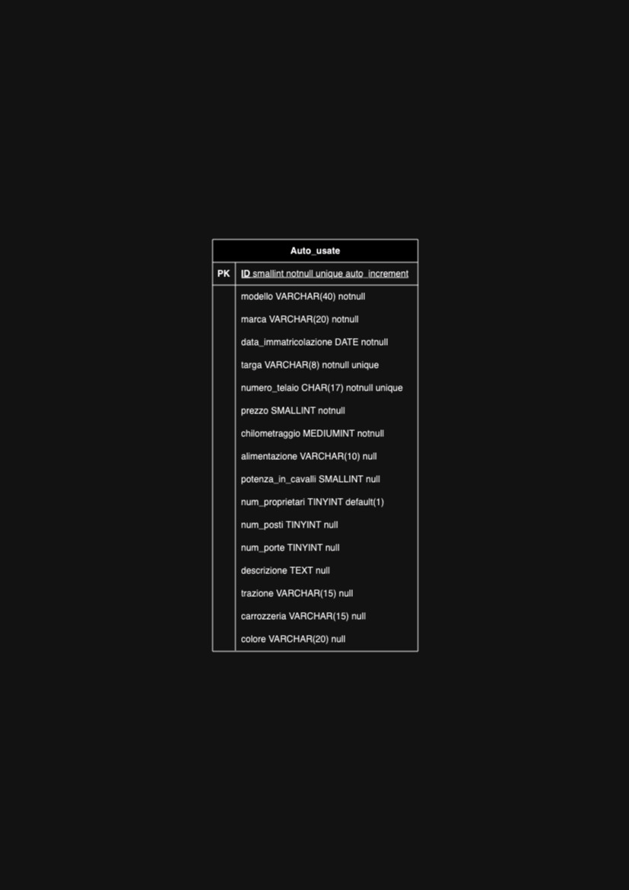

# DB Auto_usate

### Descrizione

La tabella "Auto_usate" è progettata per memorizzare informazioni dettagliate riguardanti le auto usate messe in vendita da un concessionario.

### Struttura

La struttura è:

- **modello**:

  - Attributo: Non nullo
  - Descrizione: Rappresenta il modello dell'auto usata.

- **marca**:

  - Attributo: Non nullo
  - Descrizione: Indica la marca dell'auto usata.

- **data_immatricolazione**:

  - Attributo: Non nullo
  - Descrizione: Specifica la data di immatricolazione dell'auto.

- **targa**:

  - Attributo: Non nullo, Unico
  - Descrizione: Identificativo unico della targa dell'auto.
  - Note: È stato scelto il tipo di dato varchar(8) perchè è stata prevista la casistica della targa con 8 caratteri per adattarsi al formato storico delle targhe delle auto prima degli anni 2000.

- **numero_telaio**:

  - Attributo: Non nullo, Unico
  - Descrizione: Numero unico identificativo del telaio dell'auto.

- **prezzo**:

  - Attributo: Non nullo
  - Descrizione: Indica il prezzo di vendita dell'auto usata.
  - Note: È stato scelto il tipo di dato smallint perchè la previsione del prezzo delle auto è stata definita come numero intero e non superiore a 65535.

- **chilometraggio**:

  - Attributo: Non nullo
  - Descrizione: Rappresenta il chilometraggio dell'auto.

- **alimentazione**:

  - Attributo: Opzionale (null)
  - Descrizione: Specifica il tipo di alimentazione dell'auto (benzina, diesel, elettrica, etc.).

- **potenza_in_cavalli**:

  - Attributo: Opzionale (null)
  - Descrizione: Indica la potenza dell'auto in cavalli.

- **num_proprietari**:

  - Attributo: Predefinito a 1
  - Descrizione: Numero di proprietari precedenti dell'auto.

- **num_posti**:

  - Attributo: Opzionale (null)
  - Descrizione: Indica il numero di posti dell'auto.

- **num_porte**:

  - Attributo: Opzionale (null)
  - Descrizione: Rappresenta il numero di porte dell'auto.

- **descrizione**:

  - Attributo: Opzionale (null)
  - Descrizione: Fornisce una descrizione dettagliata dell'auto.

- **trazione**:

  - Attributo: Opzionale (null)
  - Descrizione: Specifica il tipo di trazione dell'auto (anteriore, posteriore, integrale, etc.).

- **carrozzeria**:

  - Attributo: Opzionale (null)
  - Descrizione: Indica il tipo di carrozzeria dell'auto (berlina, coupé, SUV, etc.).

- **colore**:
  - Attributo: Opzionale (null)
  - Descrizione: Rappresenta il colore dell'auto.

### Diagramma

